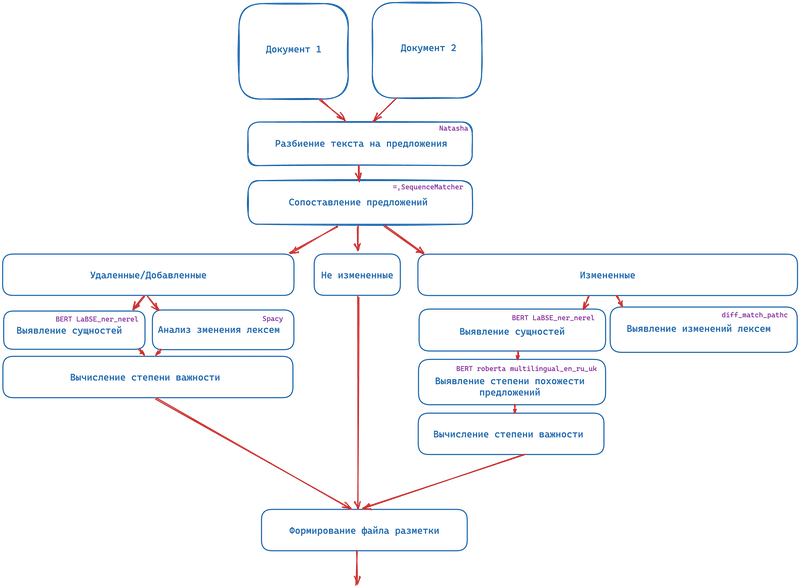

<h1>SmartDocs :boom:</h1>
<h2>About</h3>
The service allows you to semantically compare two versions of a document.
<h2>How it work</h2>

<h2>Installation :wrench:</h2>

`pip install -r requirements.txt`
 
`python -m spacy download ru_core_news_md` 
`python manage.py migrate --run-syncdb` 
`python manage.py makemigration` 
`python manage.py createsuperuser` 
`python manage.py runserver` 
<h2>Features :shipit: :shipit: :shipit:</h2>
1. Logging 
2. Deleting documents from DB 
3. Saving the results of processing in the database 
4. Integration with JIRA/REDMINE 
5. Saving results in convenient formats 
6. Selection of important criteria for evaluating documents by the user 
7. Manual training of the model through the service 
